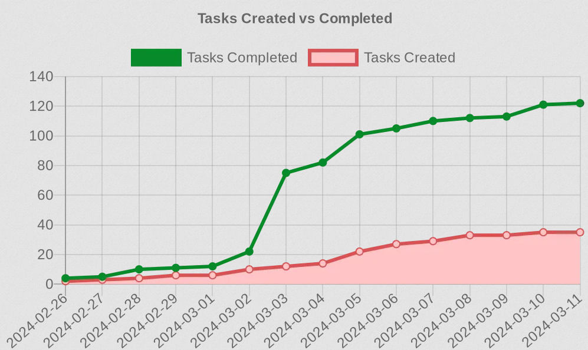

# todoist-burndown

A simple Cloudflare Worker that creates a statistics chart of my Todoist tasks

Example of the chart being created by quickchart.io




## Clouflare

This project was initialised with these commands:

```shell
npm install -g wrangler
wrangler login
wrangler init --from-dash todoist-burndown
wrangler secret put TODOIST_API_KEY
wrangler secret put TELEGRAM_BOT_TOKEN
```

Deploy with
```shell
wrangler deploy
```

## Development

Clone the repository, then run:
```shell
npm install
```

To update `wrangler`:
```shell
npm install wrangler
```

To run locally:
```shell
npx wrangler dev --test-scheduled
```


## Deployment

There is a github action that will deploy the latest version to Cloudflare